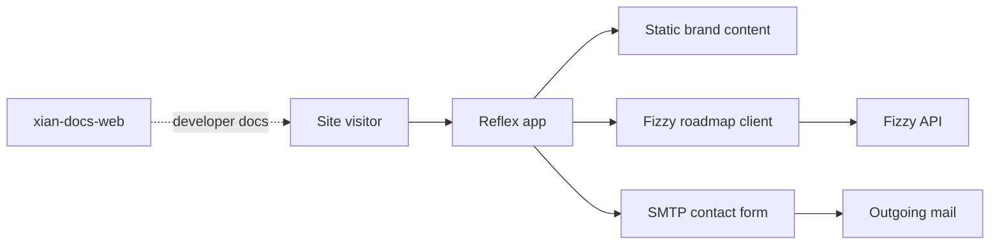

# xian-technology-web

`xian-technology-web` is the public marketing and information website for
Xian Technology. It is a Reflex app that ships the public site, the
content-driven introduction to the Xian stack, the contact form, and the
Fizzy-backed roadmap view.

This repo is the *brand site*, not the documentation. Developer
documentation lives in [`xian-docs-web`](../xian-docs-web).

## Site Flow



## Quick Start

```bash
uv sync
uv run reflex run                         # local dev
```

Production (single-port — recommended behind a reverse proxy):

```bash
uv run reflex run --env prod --single-port \
  --frontend-port 8001 --backend-port 8001
```

Production (split-port):

```bash
uv run reflex run --env prod
```

The runtime is configured in `rxconfig.py`. The app sets `REFLEX_SSR=0`
to disable server-side rendering and avoid hydration mismatches behind
the reverse proxy. OG / Twitter meta tags are injected via Nginx
instead.

## Principles

- **Brand site, not docs.** Public developer documentation belongs in
  `xian-docs-web`. This repo is for marketing, the public landing
  surface, the contact form, and the public roadmap view.
- **Reflex with disabled SSR.** Hydration mismatches behind reverse
  proxies are avoided by disabling SSR; OG meta tags are injected at
  the proxy.
- **Live data is optional.** The Fizzy-backed roadmap board loads from
  the Fizzy API when `FIZZY_TOKEN` is configured; without it the page
  still renders, just without live items.
- **No analytics-only build paths.** All public surfaces are usable
  without third-party tracking enabled.
- **Tailwind v4 + Reflex.** Styling uses the Reflex Tailwind v4 plugin
  configured in `rxconfig.py`.

## Configuration

Local development loads `.env` from the project root via `dotenv` in
`xian_tech/state.py`. These settings are only needed for live data and
contact-form delivery; the static site renders without them.

| Variable                                | Purpose                                                                     | Default                        |
| --------------------------------------- | --------------------------------------------------------------------------- | ------------------------------ |
| `FIZZY_TOKEN`                           | Read-only Fizzy API token (required for live roadmap data)                  | —                              |
| `FIZZY_ACCOUNT_SLUG`                    | Fizzy account slug                                                          | `1`                            |
| `FIZZY_BOARD_ID`                        | Fizzy board id                                                              | `03fiomkit5oknquymk0ooi26m`    |
| `FIZZY_BASE_URL`                        | Fizzy base URL                                                              | `https://tasks.xian.technology`|
| `FIZZY_EXCLUDE_TAGS`                    | Comma-separated, case-insensitive tags to hide from the roadmap             | —                              |
| `CONTACT_EMAIL_TO`                      | Recipient for contact-form submissions                                      | `info@xian.technology`         |
| `CONTACT_EMAIL_FROM`                    | From address for outgoing contact mail                                      | `SMTP_USERNAME` or recipient   |
| `SMTP_HOST`                             | SMTP host (required to send contact mail)                                   | —                              |
| `SMTP_PORT`                             | SMTP port                                                                   | `587`                          |
| `SMTP_USERNAME`, `SMTP_PASSWORD`        | SMTP credentials (password required if username is set)                     | —                              |
| `SMTP_USE_TLS`                          | Enable STARTTLS                                                             | `true`                         |
| `SMTP_USE_SSL`                          | Enable SMTPS                                                                | `false`                        |
| `CONTACT_SUBMISSION_COOLDOWN_SECONDS`   | Per-session contact-form throttle                                           | `30`                           |

`rxconfig.py` exposes:

- `app_name="xian_tech"`
- `deploy_url`, `api_url` — set to the public-facing domain
- `frontend_port=3000`, `backend_port=8000`
- `plugins=[SitemapPlugin, TailwindV4Plugin]`

## Key Directories

- `xian_tech/` — Reflex app:
  - `xian_tech.py` — app entry and route registration.
  - `pages/`, `components/` — page components and reusable UI.
  - `state/` — UI / page state machines.
  - `data.py` — static page content.
  - `fizzy_api.py` — Fizzy API client for the roadmap.
  - `contact_email.py` — SMTP-backed contact-form delivery.
  - `search.py` — site search.
  - `theme.py` — design tokens.
- `assets/` — static assets served by Reflex.
- `rxconfig.py` — Reflex runtime configuration.
- `pyproject.toml`, `uv.lock` — uv dependency configuration.
- `reflex-guide.md` — Reflex-specific notes for contributors.

## Validation

```bash
uv sync
uv run reflex run --env prod --frontend-only    # frontend-build smoke
```

## Reverse Proxy Notes

- **Single-port mode** — forward every path (including `/_event`) to the
  chosen port and enable websocket headers
  (`proxy_http_version 1.1`, `Upgrade`, `Connection "upgrade"`).
- **Split-port mode** — `/` to port 3000, `/_event` and `/sessions` to
  port 8000 with the same websocket headers.
- The CSP must include `'unsafe-eval'` in `script-src`. Reflex bundles
  rely on `new Function`; blocking it breaks hydration.
- OG / Twitter preview meta tags are injected at the Nginx layer rather
  than rendered server-side; keep that path in mind when changing the
  reverse proxy.

## Requirements

- Python 3.14
- uv
- Node.js ≥ 18 or Bun ≥ 1.1 (Reflex builds the frontend)
- A compiler toolchain for transitive native dependencies

## Related Repos

- [`../xian-docs-web/README.md`](../xian-docs-web/README.md) — public developer documentation site
- [`reflex-guide.md`](reflex-guide.md) — Reflex-specific contributor notes
